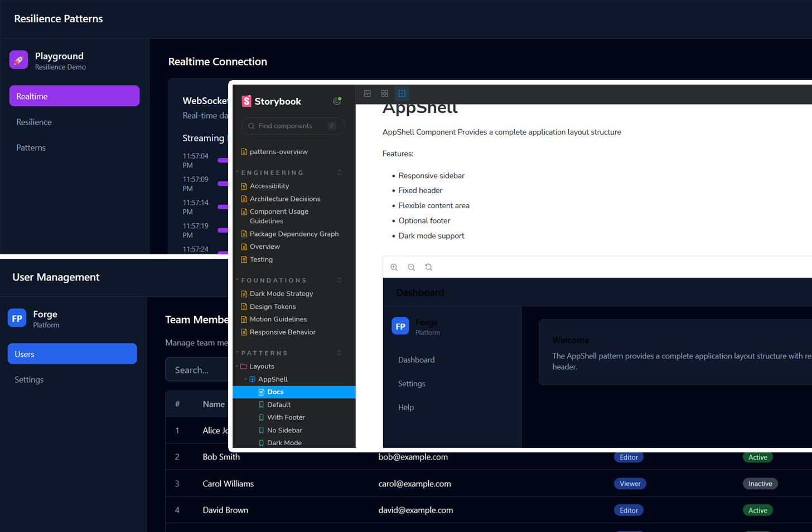

# forge-platform

A **frontend platform engineering system** with reusable UI patterns and QA infrastructure.

Instead of being a complex enterprise application, forge-platform is a **pattern library and architecture showcase** demonstrating modern frontend engineering practices.




## What Is Forge Platform?

Forge Platform is:

- ✅ A **reusable pattern library** for common UI problems
- ✅ **Storybook-driven development** with interactive documentation
- ✅ An **internal UI platform** for rapid application development
- ✅ A **testing and QA showcase** with Playwright, accessibility testing, and MSW
- ✅ **Architecture-first**: Reusable patterns > business logic

---

## Architecture Overview

forge-platform is a structured monorepo showcasing frontend platform engineering practices:

- **Frontend Patterns**: AppShell, FilterableTable, SettingsForm, AsyncSection, ThemeSwitcher
- **Storybook Documentation**: Interactive pattern showcase with accessibility and dark mode
- **Thin App Demos**: Minimal integration examples showing pattern composition
- **QA Infrastructure**: Playwright fixtures, MSW handlers, accessibility helpers
- **Developer Experience**: TypeScript strict mode, package boundaries, reusable tooling

## Quick Start

```bash
# Install dependencies
pnpm install

# Start all development servers
pnpm dev

# Start specific apps
pnpm dev:dashboard      # http://localhost:3000
pnpm dev:playground     # http://localhost:3001
pnpm storybook          # http://localhost:6006

# Build all packages
pnpm build

# Run tests
pnpm test
pnpm test:coverage
pnpm test:e2e

# Type checking and linting
pnpm type-check
pnpm lint
```

## Project Structure

```text
forge-platform/
├── apps/
│   ├── dashboard/          # Pattern showcase
│   ├── playground/         # Resilience and async patterns
│   └── storybook/          # Component documentation
├── packages/
│   ├── ui/                 # Reusable pattern library
│   ├── testing/            # QA infrastructure
│   ├── auth/               # Authentication layer
│   ├── analytics/          # PostHog integration
│   ├── monitoring/         # Sentry + accessibility monitoring
│   ├── eslint-config/      # Shared ESLint rules
│   └── ts-config/          # Shared TypeScript configs
├── .github/workflows/      # CI/CD pipelines
└── turbo.json              # Turborepo configuration
```

## Core Concepts

### Patterns Over Components

Unlike a traditional component library, forge-platform focuses on **patterns** — composable solutions to recurring UI problems:

- **Primitive Components** — Input, Button, Dialog
- **Patterns** — AppShell, FilterableTable, AsyncSection
- **Integration Examples** — dashboard and playground apps

### Storybook as Centerpiece

Storybook is the primary way to explore, test, and document patterns:

- Interactive stories for each pattern
- Accessibility audits built into stories
- Dark mode and responsive examples
- Copy-paste usage examples

### Thin Apps for Demonstration

The apps are intentionally lightweight integration demos:

- **dashboard** — AppShell, FilterableTable, SettingsForm, CRUD patterns
- **playground** — retry logic, async boundaries, realtime simulation

Each app composes patterns from `@forge/ui` with minimal custom code.

### Testing as First-Class

`packages/testing` provides reusable QA infrastructure:

- Playwright fixtures
- MSW handlers
- Accessibility helpers
- Mock factories
- Integration test utilities

---

## Monorepo Architecture

```text
┌──────────────────────────────────────────────────────┐
│         Reusable Pattern Library (@forge/ui)         │
├───────────┬────────────┬──────────┬────────┬─────────┤
│ Layouts   │ Async      │ Data     │ Forms  │ UX      │
├───────────┴────────────┴──────────┴────────┴─────────┤
│  Primitives: Button, Input, Dialog, etc.            │
└───────────────────────┬────────────────────────────┘
                        │
        ┌───────────────┼───────────────┐
        │               │               │
    ┌───▼────────┐  ┌──▼──────────┐  ┌─▼──────────────┐
    │ Dashboard  │  │ Playground  │  │ Storybook Docs │
    │ (Patterns) │  │ (Resilience)│  │ (Showcase)     │
    └────────────┘  └─────────────┘  └────────────────┘
```

## Usage Examples

### Using Patterns in an App

```tsx
import {
  AppShell,
  PageContainer,
  FilterableTable,
  AsyncSection,
  type Column,
} from '@forge/ui';

export function UserManagement() {
  const { data: users, isLoading, error } = useUsers();

  const columns: Column<User>[] = [
    { id: 'name', header: 'Name', accessor: (row) => row.name },
    { id: 'email', header: 'Email', accessor: (row) => row.email },
  ];

  return (
    <AppShell sidebar={<Navigation />} header={<Header />}>
      <PageContainer title="Users">
        <AsyncSection isLoading={isLoading} error={error}>
          <FilterableTable
            data={users}
            columns={columns}
            onFilter={handleFilter}
            onSort={handleSort}
          />
        </AsyncSection>
      </PageContainer>
    </AppShell>
  );
}
```

### Writing Tests with Testing Infrastructure

```tsx
import { test, expect } from '@playwright/test';
import { setupTestApp } from '@forge/testing/fixtures';
import { userFactory } from '@forge/testing/factories';

test('filter users by name', async ({ page }) => {
  const users = [
    userFactory.build({ name: 'Alice' }),
    userFactory.build({ name: 'Bob' }),
  ];

  await setupTestApp(page, { users });
  await page.fill('[placeholder="Search..."]', 'Alice');

  const rows = await page.locator('table tbody tr');
  expect(rows).toHaveCount(1);
});
```

## Development Standards

### Code Organization

- **Type Safety**: TypeScript strict mode across all packages
- **Package Isolation**: Clear public APIs per package
- **Component Colocation**: Stories, tests, and components together
- **Naming Conventions**: Patterns > Components > Utilities

### Testing

- **Unit Tests**: Vitest
- **Integration Tests**: Pattern composition testing
- **E2E Tests**: Playwright across browsers
- **Accessibility**: Built into stories and E2E
- **Coverage Goal**: >80% for reusable patterns

### Documentation

- Storybook stories for all major patterns
- JSDoc for public APIs
- Package-level READMEs
- Inline comments for complex logic

---

## CI/CD Pipeline

The project includes a production-style CI pipeline with:

- ✅ Linting and type checking
- ✅ Dependency security scanning
- ✅ Unit and integration tests
- ✅ Parallelized Turborepo builds
- ✅ Cross-browser Playwright E2E tests
- ✅ Accessibility testing
- ✅ Lighthouse performance audits
- ✅ Artifact uploads for debugging and reporting

### Workflow Overview

```text
lint
 ├── typecheck
 ├── security-scan
 └── unit-tests
       ├── build (dashboard/playground matrix)
       ├── accessibility
       ├── lighthouse
       └── e2e (chromium/firefox/webkit matrix)
```

---

## Tech Stack Summary

| Layer | Technology |
|-------|------------|
| **Language** | TypeScript 5+ |
| **React** | React 19 |
| **Build** | Vite 5, Turborepo |
| **Monorepo** | pnpm workspaces |
| **UI** | Radix UI + Tailwind CSS |
| **State** | Zustand |
| **Testing** | Vitest, RTL, Playwright |
| **Mocking** | MSW |
| **Linting** | ESLint, Prettier |
| **Monitoring** | Sentry |
| **Analytics** | PostHog |
| **Accessibility** | Axe-core |
| **Docs** | Storybook 7 |

---

## Why This Project Exists

forge-platform was created as a **frontend platform engineering showcase** focused on:

- reusable UI architecture
- scalable monorepo organization
- QA infrastructure and testing strategy
- accessibility and performance
- production-style CI/CD workflows

The goal is to demonstrate how modern frontend teams can build reusable systems instead of isolated applications.

---

## Documentation

Additional documentation:

- [Architecture Decisions](./ARCHITECTURE.md)
- [Package Development Guide](./PACKAGES.md)
- [Testing Guide](./TESTING.md)
- [Contributing Guidelines](./CONTRIBUTING.md)

## Contributing

See [CONTRIBUTING.md](./CONTRIBUTING.md) for contribution guidelines and development workflow.

## License

Proprietary - forge-platform
